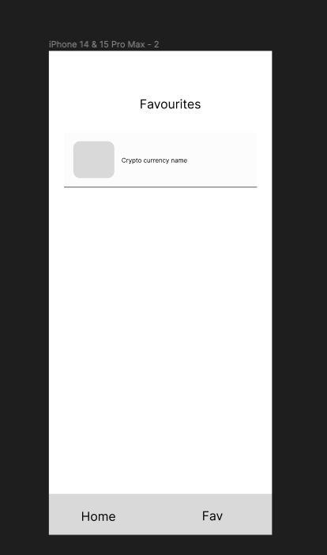
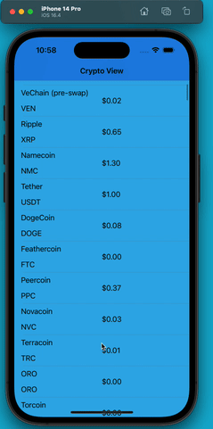

Original App Design Project - README Template
===

# CryptoVIew

## Table of Contents

1. [Overview](#Overview)
2. [Product Spec](#Product-Spec)
3. [Wireframes](#Wireframes)
4. [Schema](#Schema)

## Overview

### Description

CryptoView is the ultimate tool for cryptocurrency enthusiasts, traders, and investors who want to stay in the know about the latest cryptocurrency rates. Whether you're an experienced trader or just getting started, CryptoView provides you with real-time data on cryptocurrency prices, allowing you to make informed decisions in the ever-changing world of digital currencies.

### App Evaluation

 - **Category:** Lifestyle/Investment
 - **Mobile:** The cryptocurrency tracker app offers a uniquely mobile experience by providing real-time updates on cryptocurrency prices, charts, and portfolio tracking
- **Story:**  Users monitor their cryptocurrency investments, make informed decisions, and potentially achieve financial success through digital assets.
- **Market:** The market for cryptocurrency-related apps is significant, with a large user base of cryptocurrency enthusiasts, traders, and investors worldwide.
- **Habit:**  users frequently opening it to check cryptocurrency prices, monitor their portfolios, and set personalized price alerts.
- **Scope:** V1  basic cryptocurrency price tracking, a simple portfolio feature, and price alerts, making it valuable even with a more streamlined set of features. V2 encompassing features like  real-time alerts, and a user-friendly interface.

## Product Spec

### 1. User Stories (Required and Optional)

**Required Must-have Stories**

* User can view all the currencies
* User can search their choice of crypto currency
* User can mark their favorite currency
* User can get in detail view of the currency the tap
* User can view their favourite currency

**Optional Nice-to-have Stories**

* User can view the price chart
* User can create their portfolio to track their profit

### 2. Screen Archetypes

- [x]  Home/ View All currency
* User can view all the currencies
* User can search their choice of crypto currency

- [ ] Favourite currency 
* User can view their favourite currency

- [ ] Detail screen
* User can mark their favorite currency
*  User can get in detail view of the currency the tap

### 3. Navigation

**Tab Navigation** (Tab to Screen)

* Home 
* Detail screen

**Flow Navigation** (Screen to Screen)

* Home
=> Favourite currency

* Home
=> My portfolio (optional)

## Wireframes

### [BONUS] Digital Wireframes & Mockups

### [BONUS] Interactive Prototype

## Schema 
### Created the story board still left to link with the decoded data

### Models

### Networking
API used 
- https://min-api.cryptocompare.com/data/all/coinlist

## Reflection

### 1. What went well during this unit?

Setting up the files

### 2. What were some challenges your group faced in this unit?

Trying to figure out struct 

### Did you finish all of your tasks in your sprint plan for this week? If you did not finish all of the planned tasks, how would you prioritize the remaining tasks on your list?

yes, would focus more on the design

### Which features and user stories would you consider “at risk”? How will you change your plan if those items remain “at risk”?

Search option

### 5. What additional support will you need in upcoming units as you continue to work on your final project?

null